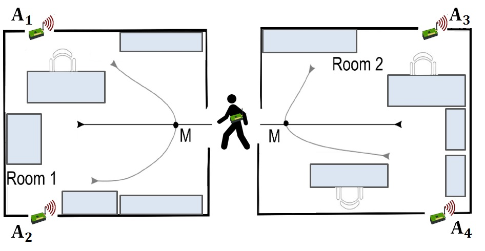

.. _quick-start-label:

Quick Start
===========

Nola instalatu
---------------

TSeries-featurizer liburutegia Python Package Indexean (PyPI) aurki daitekeenez, erraz instala daiteke pip bidez

.. code:: shell

   pip install tseries-featurizer

Nola hasi
----------

Dokumentazio osoa irakurtzen hasi aurretik, tseries-featurizer erabiltzen hasi zaitezke ondorengo adibidearen bidez:

Hainbat etxetako lau mugimendu sentsoreren datu-multzoa jaso dugu.
Beheko irudian ikus daitekeen moduan, etxe bakoitzean, bi gelaren izkinetan kokatuta, lau mugimendu sentsore aurki daitezke.
Helburua, etxe bakoitzeko sentsoreek jasotako datuen arabera pertsona gelaz aldatuko den edo ez iragartzea da.

Lehenik https://archive.ics.uci.edu/ml/machine-learning-databases/00348/ estekaren bidez dataseta jaitsiko dugu, ondoren
python bidez prozesatzeko.
Prozesua hobeto ulertzeko, lehenengo ehun fitxategiak zerrenda baten gehituko ditugu.

.. code:: python

    import pandas as pd
    dfs = list()
    for file in range(1, 100):
        df = pd.read_csv(f'MovementAAL_RSS_{file}.csv')
        dfs.append(df)
    ys = pd.read_csv('MovementAAL_target.csv')

pandas.DataFrame denbora segida zerrenda bat lortuz.

.. code:: python

   print(dfs[0].head())

+-----+-------------+-------------+-------------+-------------+
|     | RSS_anchor1 | RSS_anchor2 | RSS_anchor3 | RSS_anchor4 |
+-----+-------------+-------------+-------------+-------------+
|  0  |   -0.90476  |    -0.48    |   0.28571   |     0.3     |
+-----+-------------+-------------+-------------+-------------+
|  1  |   -0.57143  |    -0.32    |   0.14286   |     0.3     |
+-----+-------------+-------------+-------------+-------------+
|  2  |   -0.38095  |    -0.28    |   -0.14286  |     0.35    |
+-----+-------------+-------------+-------------+-------------+
|  3  |   -0.28571  |     -0.2    |   -0.47619  |     0.35    |
+-----+-------------+-------------+-------------+-------------+
|  4  |   -0.14286  |     -0.2    |   0.14286   |     -0.2    |
+-----+-------------+-------------+-------------+-------------+
|  5  |   -0.14286  |     -0.2    |   0.047619  |      0      |
+-----+-------------+-------------+-------------+-------------+
| ... |     ...     |     ...     |     ...     |     ...     |
+-----+-------------+-------------+-------------+-------------+

Hauek lehenengo etxeko neurketak dira, denboran zehar 4 mugimendu sentsoreek jasotako datuak.
Hainbat etxetako (314 kasu honetan) neurketak dauzkagunez, guztien ezaugarriak erauzi nahi izanez gero,
lagin bakoitza zerrenda bateko elementu izatea besterik ez da egin behar.

Kasu honetan emaitzak aparteko fitxategi batetik kargatu dira, eta ``ys`` aldagaian gorde dira.

``ys`` aldagaiak hainbat etxebizitzaren emaitzak ditu, -1 eta 1 emaitzekin, gela pasa duen edo ez adieraziz:

+-----+--------------+--------------+
|     | #sequence_ID |  class_label |
+-----+--------------+--------------+
|  0  |       1      |       1      |
+-----+--------------+--------------+
|  1  |       2      |       1      |
+-----+--------------+--------------+
|  2  |       3      |       1      |
+-----+--------------+--------------+
|  3  |       4      |       1      |
+-----+--------------+--------------+
|  4  |       5      |       1      |
+-----+--------------+--------------+
|  5  |       6      |       1      |
+-----+--------------+--------------+
| ... |      ...     |      ...     |
+-----+--------------+--------------+

Hemen ikus daiteke lehen 6 etxeetako neurketetan gela aldaketa egon dela.

Ondorengo irudian lehenengo etxeko neurketak irudikatuko ditugu, bertan gela aldaketa egon da:

.. code:: python

    import matplotlib.pyplot as plt
    dfs[0].plot(subplots=True, sharex=True, figsize=(10,10))
    plt.show()

27. etxean berriz ez da gela aldaketarik egon:

.. code:: python

    df[26].plot(subplots=True, sharex=True, figsize=(10,10))
    plt.show()

Begi-bistaz ikus daitezke desberdintasunak, baina sailkapenak funtziona dezan, desberdintasun horiek zenbaki bihurtu behar dira.

Hau tseries-featurizerraren bidez lortzen da.
Etxebizitza bakoitzeko sentsore bakoitzaren ehundaka ezaugarri erauzten ditu automatikoki, datuak modelatuz.

Ezaugarri guztiak erauzteko:

.. code:: python

    from ts_featurizer import TimeSeriesFeaturizer
    tseries = TimeSeriesFeaturizer()
    model_features = tseries.featurize(dfs[:10], n_jobs=-1)
    features = tseries.featurize(dfs[10:], n_jobs=-1, apply_model=True)

`featurize` funtzioaren bidez, pasatako zerrendako pandas.DataFrametan aurkitzen diren denbora segiden ezaugarriak erauzten
dira. Egitura bera jarraitzeko, lehenik ezaugarri horien modeloa sortzen da, maiztasun garrantzitsuenak eta beste hainbat
faktore lortuz, horretarako datuen zati txiki bat erabiliko da, itzuleran ezaugarriak lortuz.
Bigarren fasean, berriz, modelo hori aplikatuko da ``apply_model`` argumentua erabiliz.

``model_features`` eta ``features`` egitura bera duten bi pandas.DataFrame dira, non lehenak modelatzeko
erabili diren datuen ezaugarriak izango dituen, eta bigarrenak beste datu guztienak.

DataFrame hauek milaka ezaugarri dituzte, transformatzailearen arabera banatuta. Ezaugarri erauzketa prozesuan lortutako
emaitzak ``NaN`` balioak izan ditzakeela ikusiz gero, edozein sailkatzaile edota erregresio erabili aurretik hauek kendu
egin beharko dira.

Lortutako ezaugarrien batzuen artean, korrelazio handia egongo da, eta beraz, iragarpenak egiteko edo entrenamendurako
behar den denbora murrizteko, komenigarria da korrelazio handia duten ezaugarrietatik (2tik 1) ezabatzea, ezaugarri
erredundanteak kenduz.

Behin pausu hauek emanda, lortutako ezaugarriak `feature` gisa erabiliko dira, sailkapen modeloko `ys`arekin batera.
Datu hauekin, Random Forest modelo bat sortu genezake, adibidez, sklearn erabiliz:

.. code:: python

    from sklearn.ensemble import RandomForestClassifier
    from sklearn.model_selection import train_test_split
    rfc = RandomForestClassifier()
    X_train, X_test, y_train, y_test = train_test_split(features, ys[' label_class'][:100], train_size=0.75)
    rfc.fit(X_train, y_train)
    print(rfc.score(X_test, y_test))

